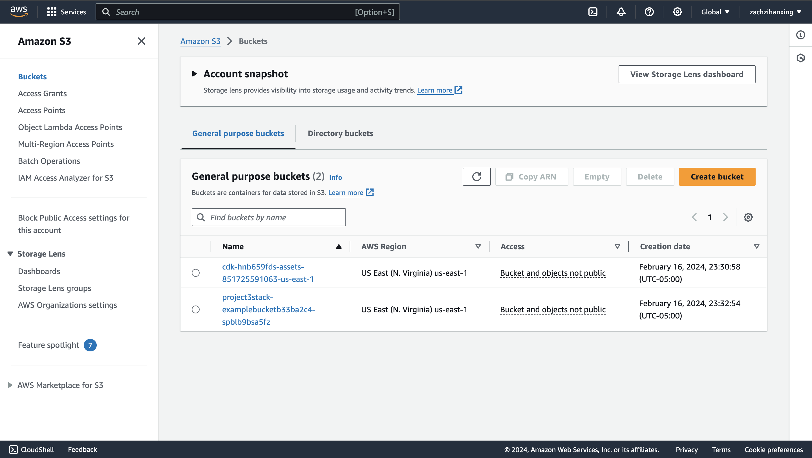

<!-- # Welcome to your CDK TypeScript project

You should explore the contents of this project. It demonstrates a CDK app with an instance of a stack (`Project3Stack`)
which contains an Amazon SQS queue that is subscribed to an Amazon SNS topic.

The `cdk.json` file tells the CDK Toolkit how to execute your app.

## Useful commands

* `npm run build`   compile typescript to js
* `npm run watch`   watch for changes and compile
* `npm run test`    perform the jest unit tests
* `cdk deploy`      deploy this stack to your default AWS account/region
* `cdk diff`        compare deployed stack with current state
* `cdk synth`       emits the synthesized CloudFormation template -->

# AWS S3 Bucket Creation with AWS CDK and CodeWhisperer

IDS721 Mini-Project-3

## Project Overview

This project demonstrates the creation of an Amazon S3 bucket using the AWS Cloud Development Kit (AWS CDK). The CDK code for the S3 bucket was generated with the assistance of AWS CodeWhisperer, showcasing how this AI-powered service can accelerate the development process.

## Author

Zihan(Zach) Xing

## Features

- **AWS S3 Bucket**: Provisions a new S3 bucket with versioning and encryption features enabled.
- **AWS CDK**: Infrastructure is defined using TypeScript and AWS CDK.
- **AWS CodeWhisperer**: Code generation for the S3 bucket is facilitated by CodeWhisperer.

## How to Use

To deploy this stack to your AWS account, ensure you have the AWS CLI configured and follow these steps:

1. Install the necessary dependencies:
   ```bash
   npm install
   ```
2. Compile the TypeScript code to JavaScript:
   ```bash
   npx tsc
   ```
3. Deploy the stack to your AWS account:
   ```bash
   cdk deploy
   ```

## AWS CodeWhisperer Usage

AWS CodeWhisperer was utilized to generate the initial CDK code for the S3 bucket creation. The code generation process involved the following steps:

1. Writing a comment in `lib/project-3-stack.ts` describing the desired S3 bucket features.
2. Activating CodeWhisperer's code suggestion feature.
3. Selecting the most appropriate code snippet from the suggestions provided by CodeWhisperer.
4. Refining the generated code to align with the project requirements.

This approach allowed for rapid development and ensured that best practices for S3 bucket creation were followed.

## Screenshots

### AWS Management Console - S3 Bucket



### Terminal - Deployment Success


## Documentation

For more detailed documentation, please refer to the following resources:

- [AWS CDK Documentation](https://docs.aws.amazon.com/cdk/latest/guide/home.html)
- [AWS S3 Documentation](https://docs.aws.amazon.com/s3/index.html)
- [AWS CodeWhisperer Documentation](https://aws.amazon.com/codewhisperer/)
